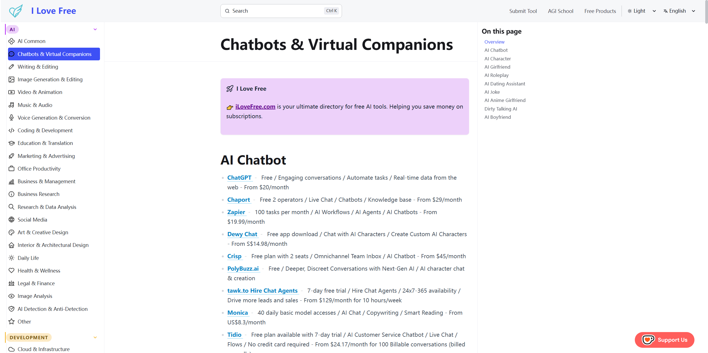

# Free Website Navigation Directory | I Love Free

<!-- split-by-split-fwn-en v1 -->

> A curated directory of 14,614+ free websites across 24 categories.

---

I Love Free

👉 **[iLoveFree.com](https://www.ilovefree.com/free-website-navigation/audio/)** is your ultimate directory for free websites and resources. Helping you discover the best free tools across the web.

---

**📖 Table of Contents — 24 categories**

- [Music / Podcasts / Radio](./01-music-podcasts-radio.md)
  - [Audio Streaming](./01-music-podcasts-radio.md#audio-streaming)
  - [Specialty Streaming](./01-music-podcasts-radio.md#specialty-streaming)
  - [Radio Streaming](./01-music-podcasts-radio.md#radio-streaming)
  - [Spotify Tools](./01-music-podcasts-radio.md#spotify-tools)
  - [Audio Ripping](./01-music-podcasts-radio.md#audio-ripping)
  - [Audio Torrenting](./01-music-podcasts-radio.md#audio-torrenting)
  - [Royalty Free Music](./01-music-podcasts-radio.md#royalty-free-music)
  - [Media Soundtracks](./01-music-podcasts-radio.md#media-soundtracks)
  - [Tracking / Databases](./01-music-podcasts-radio.md#tracking--databases)
  - [Audio Tools](./01-music-podcasts-radio.md#audio-tools)
  - [Audio Editing](./01-music-podcasts-radio.md#audio-editing)
- [Movies / TV / Anime](./02-movies-tv-anime.md)
  - [Streaming Sites](./02-movies-tv-anime.md#streaming-sites)
  - [Specialty Streaming](./02-movies-tv-anime.md#specialty-streaming)
  - [Live TV / Sports](./02-movies-tv-anime.md#live-tv--sports)
  - [Smart TV](./02-movies-tv-anime.md#smart-tv)
  - [Download Sites](./02-movies-tv-anime.md#download-sites)
  - [Torrent Apps](./02-movies-tv-anime.md#torrent-apps)
  - [Torrent Sites](./02-movies-tv-anime.md#torrent-sites)
  - [Tracking / Databases](./02-movies-tv-anime.md#tracking--databases)
  - [Subtitle Tools](./02-movies-tv-anime.md#subtitle-tools)
  - [Helpful Sites / Tools](./02-movies-tv-anime.md#helpful-sites--tools)
- [Gaming / Emulation](./03-gaming-emulation.md)
  - [Download Games](./03-gaming-emulation.md#download-games)
  - [Special Interest](./03-gaming-emulation.md#special-interest)
  - [Emulation / ROMs](./03-gaming-emulation.md#emulation--roms)
  - [Puzzle Games](./03-gaming-emulation.md#puzzle-games)
  - [Tabletop Games](./03-gaming-emulation.md#tabletop-games)
  - [Browser Games](./03-gaming-emulation.md#browser-games)
- [Books / Comics / Manga](./04-books-comics-manga.md)
  - [Ebooks](./04-books-comics-manga.md#ebooks)
  - [Special Interest](./04-books-comics-manga.md#special-interest)
  - [Audiobooks](./04-books-comics-manga.md#audiobooks)
  - [Visual Media](./04-books-comics-manga.md#visual-media)
  - [Educational Books](./04-books-comics-manga.md#educational-books)
  - [Documents / Articles](./04-books-comics-manga.md#documents--articles)
  - [Esoteric / Cultural](./04-books-comics-manga.md#esoteric--cultural)
  - [Tracking / Database](./04-books-comics-manga.md#tracking--database)
  - [Helpful Sites / Apps](./04-books-comics-manga.md#helpful-sites--apps)
- [Downloading](./05-downloading.md)
  - [Download Directories](./05-downloading.md#download-directories)
  - [Download Sites](./05-downloading.md#download-sites)
  - [Software Sites](./05-downloading.md#software-sites)
  - [Usenet](./05-downloading.md#usenet)
  - [Debrid / Leeches](./05-downloading.md#debrid--leeches)
- [Torrenting](./06-torrenting.md)
  - [Torrent Sites](./06-torrenting.md#torrent-sites)
  - [Torrent Clients](./06-torrenting.md#torrent-clients)
  - [Private Trackers](./06-torrenting.md#private-trackers)
  - [Helpful Sites / Apps](./06-torrenting.md#helpful-sites--apps)
- [Educational](./07-educational.md)
  - [Documentaries](./07-educational.md#documentaries)
  - [Courses](./07-educational.md#courses)
  - [Learning Sites](./07-educational.md#learning-sites)
  - [Science / Math](./07-educational.md#science--math)
  - [Space](./07-educational.md#space)
  - [History](./07-educational.md#history)
  - [Humanities](./07-educational.md#humanities)
  - [Skills / Hobbies / DIY](./07-educational.md#skills--hobbies--diy)
  - [Language Learning](./07-educational.md#language-learning)
  - [Developer Learning](./07-educational.md#developer-learning)
  - [Exam Prep](./07-educational.md#exam-prep)
  - [Educational Tools](./07-educational.md#educational-tools)
- [Adblocking / Privacy](./08-adblocking-privacy.md)
  - [Adblocking](./08-adblocking-privacy.md#adblocking)
  - [Antivirus / Anti-Malware](./08-adblocking-privacy.md#antivirus--anti-malware)
  - [Privacy / Security](./08-adblocking-privacy.md#privacy--security)
  - [Web Privacy](./08-adblocking-privacy.md#web-privacy)
  - [VPN](./08-adblocking-privacy.md#vpn)
  - [Proxy](./08-adblocking-privacy.md#proxy)
- [Android / iOS](./09-android-ios.md)
  - [Android APKs](./09-android-ios.md#android-apks)
  - [Android Device](./09-android-ios.md#android-device)
  - [Android Camera](./09-android-ios.md#android-camera)
  - [Android Tools](./09-android-ios.md#android-tools)
  - [Emulators](./09-android-ios.md#emulators)
  - [Android Torrenting](./09-android-ios.md#android-torrenting)
  - [Android Reading](./09-android-ios.md#android-reading)
  - [Android Audio](./09-android-ios.md#android-audio)
  - [Android Streaming](./09-android-ios.md#android-streaming)
  - [iOS Tools](./09-android-ios.md#ios-tools)
  - [iOS iPAs](./09-android-ios.md#ios-ipas)
  - [iOS Audio](./09-android-ios.md#ios-audio)
  - [iOS Streaming](./09-android-ios.md#ios-streaming)
  - [iOS Reading](./09-android-ios.md#ios-reading)
- [Linux / macOS](./10-linux-macos.md)
  - [Linux Guides](./10-linux-macos.md#linux-guides)
  - [Linux Communities](./10-linux-macos.md#linux-communities)
  - [Linux Distros](./10-linux-macos.md#linux-distros)
  - [Linux Apps](./10-linux-macos.md#linux-apps)
  - [Linux Tools](./10-linux-macos.md#linux-tools)
  - [Customization](./10-linux-macos.md#customization)
  - [Mac Apps](./10-linux-macos.md#mac-apps)
  - [Mac Tools](./10-linux-macos.md#mac-tools)
  - [Unix-Like](./10-linux-macos.md#unix-like)
- [Non-English](./11-non-english.md)
  - [Arabic / العربية](./11-non-english.md#arabic)
  - [Bangla / বাংলা](./11-non-english.md#bangla)
  - [Bulgarian / Български](./11-non-english.md#bulgarian)
  - [Chinese / 华语](./11-non-english.md#chinese)
  - [Czech / Čeština](./11-non-english.md#czech--etina)
  - [Filipino / Pinoy](./11-non-english.md#filipino--pinoy)
  - [Finnish / Suomi](./11-non-english.md#finnish--suomi)
  - [French / Français](./11-non-english.md#french--franais)
  - [German / Deutsch](./11-non-english.md#german--deutsch)
  - [Greek / Ελληνικά](./11-non-english.md#greek)
  - [Hebrew / עברית](./11-non-english.md#hebrew)
  - [Hungarian / Magyar](./11-non-english.md#hungarian--magyar)
  - [Indian Languages](./11-non-english.md#indian-languages)
  - [Indonesian / Bahasa Indonesia](./11-non-english.md#indonesian--bahasa-indonesia)
  - [Italian / Italiano](./11-non-english.md#italian--italiano)
  - [Japanese / 日本語](./11-non-english.md#japanese)
  - [Korean / 한국어](./11-non-english.md#korean)
  - [Malay / Bahasa Melayu](./11-non-english.md#malay--bahasa-melayu)
  - [Persian / فارسی](./11-non-english.md#persian)
  - [Polish / Polski](./11-non-english.md#polish--polski)
  - [Portuguese / Português](./11-non-english.md#portuguese--portugus)
  - [Romanian / Limba Română](./11-non-english.md#romanian--limba-romn)
  - [Russian / Русский](./11-non-english.md#russian)
  - [Slovak / Slovenčina](./11-non-english.md#slovak--slovenina)
  - [Spanish / Español](./11-non-english.md#spanish--espaol)
  - [Swedish / Sverige](./11-non-english.md#swedish--sverige)
  - [Thai / ไทย](./11-non-english.md#thai)
  - [Turkish / Türkçe](./11-non-english.md#turkish--trke)
  - [Ukrainian / Українська](./11-non-english.md#ukrainian)
  - [Uzbek / Ўзбек](./11-non-english.md#uzbek)
  - [Vietnamese / Việt](./11-non-english.md#vietnamese--vit)
  - [Other Languages](./11-non-english.md#other-languages)
- [Miscellaneous](./12-miscellaneous.md)
  - [Indexes](./12-miscellaneous.md#indexes)
  - [Free Stuff](./12-miscellaneous.md#free-stuff)
  - [Food](./12-miscellaneous.md#food)
  - [Fashion / Clothing](./12-miscellaneous.md#fashion--clothing)
  - [Household](./12-miscellaneous.md#household)
  - [Gardening](./12-miscellaneous.md#gardening)
  - [Vehicle](./12-miscellaneous.md#vehicle)
  - [Travel](./12-miscellaneous.md#travel)
  - [Maps](./12-miscellaneous.md#maps)
  - [News](./12-miscellaneous.md#news)
  - [Health](./12-miscellaneous.md#health)
  - [Career](./12-miscellaneous.md#career)
  - [Shopping](./12-miscellaneous.md#shopping)
  - [Useful Sites](./12-miscellaneous.md#useful-sites)
  - [Fun Sites](./12-miscellaneous.md#fun-sites)
- [System Tools](./13-system-tools.md)
  - [System Tools](./13-system-tools.md#system-tools)
  - [Hardware Tools](./13-system-tools.md#hardware-tools)
  - [Windows ISOs](./13-system-tools.md#windows-isos)
  - [Customization](./13-system-tools.md#customization)
- [File Tools](./14-file-tools.md)
  - [File Tools](./14-file-tools.md#file-tools)
  - [PDF Tools](./14-file-tools.md#pdf-tools)
  - [File Transfer](./14-file-tools.md#file-transfer)
  - [File Hosts](./14-file-tools.md#file-hosts)
- [Internet Tools](./15-internet-tools.md)
  - [Internet Tools](./15-internet-tools.md#internet-tools)
  - [RSS Tools](./15-internet-tools.md#rss-tools)
  - [Search Tools](./15-internet-tools.md#search-tools)
  - [URL Tools](./15-internet-tools.md#url-tools)
  - [Email Tools](./15-internet-tools.md#email-tools)
  - [Browser Bookmarks](./15-internet-tools.md#browser-bookmarks)
  - [Browser Startpages](./15-internet-tools.md#browser-startpages)
  - [Browser Tools](./15-internet-tools.md#browser-tools)
  - [Archiving](./15-internet-tools.md#archiving)
  - [Open Source Intelligence](./15-internet-tools.md#open-source-intelligence)
- [Social Media Tools](./16-social-media-tools.md)
  - [Social Media Tools](./16-social-media-tools.md#social-media-tools)
  - [Discord Tools](./16-social-media-tools.md#discord-tools)
  - [Reddit Tools](./16-social-media-tools.md#reddit-tools)
  - [Telegram Tools](./16-social-media-tools.md#telegram-tools)
  - [YouTube Tools](./16-social-media-tools.md#youtube-tools)
  - [Bilibili Tools](./16-social-media-tools.md#bilibili-tools)
  - [Twitch Tools](./16-social-media-tools.md#twitch-tools)
  - [Twitter/X Tools](./16-social-media-tools.md#twitterx-tools)
  - [Facebook Tools](./16-social-media-tools.md#facebook-tools)
  - [Instagram Tools](./16-social-media-tools.md#instagram-tools)
  - [Blogging Tools](./16-social-media-tools.md#blogging-tools)
  - [Tumblr Tools](./16-social-media-tools.md#tumblr-tools)
  - [Fediverse Tools](./16-social-media-tools.md#fediverse-tools)
  - [4chan Tools](./16-social-media-tools.md#4chan-tools)
- [Text Tools](./17-text-tools.md)
  - [Text Tools](./17-text-tools.md#text-tools)
  - [Text Editors](./17-text-tools.md#text-editors)
  - [Markup Tools](./17-text-tools.md#markup-tools)
  - [Fonts](./17-text-tools.md#fonts)
  - [Font Tools](./17-text-tools.md#font-tools)
- [Gaming Tools](./18-gaming-tools.md)
  - [Gaming Tools](./18-gaming-tools.md#gaming-tools)
  - [Tracking / Databases](./18-gaming-tools.md#tracking--databases)
  - [Steam / Epic](./18-gaming-tools.md#steam--epic)
  - [Multiplayer Tools](./18-gaming-tools.md#multiplayer-tools)
  - [Homebrew](./18-gaming-tools.md#homebrew)
  - [Minecraft Tools](./18-gaming-tools.md#minecraft-tools)
  - [Genre specific](./18-gaming-tools.md#genre-specific)
  - [Game Specific](./18-gaming-tools.md#game-specific)
- [Image Tools](./19-image-tools.md)
  - [Image Editing](./19-image-tools.md#image-editing)
  - [Image Creation](./19-image-tools.md#image-creation)
  - [Design Resources / Ideas](./19-image-tools.md#design-resources--ideas)
  - [Download Images](./19-image-tools.md#download-images)
  - [3D Models](./19-image-tools.md#3d-models)
  - [Image Tools](./19-image-tools.md#image-tools)
  - [Photography / Cameras](./19-image-tools.md#photography--cameras)
- [Video Tools](./20-video-tools.md)
  - [Video Tools](./20-video-tools.md#video-tools)
  - [Video Players](./20-video-tools.md#video-players)
  - [Media Servers](./20-video-tools.md#media-servers)
  - [Video Download](./20-video-tools.md#video-download)
  - [Video Editing](./20-video-tools.md#video-editing)
- [Developer Tools](./21-developer-tools.md)
  - [Dev Communities](./21-developer-tools.md#dev-communities)
  - [Dev News](./21-developer-tools.md#dev-news)
  - [Developer Tools](./21-developer-tools.md#developer-tools)
  - [Game Dev Tools](./21-developer-tools.md#game-dev-tools)
  - [IDEs / Code Editors](./21-developer-tools.md#ides--code-editors)
  - [AI Tools](./21-developer-tools.md#ai-tools)
  - [Programming Languages](./21-developer-tools.md#programming-languages)
  - [Web Development](./21-developer-tools.md#web-development)
  - [Web Dev Tools](./21-developer-tools.md#web-dev-tools)
  - [Hosting Tools](./21-developer-tools.md#hosting-tools)
  - [Cybersecurity Tools](./21-developer-tools.md#cybersecurity-tools)
- [Artificial Intelligence](./22-artificial-intelligence.md)
  - [AI Chatbots](./22-artificial-intelligence.md#ai-chatbots)
  - [AI Writing Tools](./22-artificial-intelligence.md#ai-writing-tools)
  - [Video Generation](./22-artificial-intelligence.md#video-generation)
  - [Image Generation](./22-artificial-intelligence.md#image-generation)
  - [Audio Generation](./22-artificial-intelligence.md#audio-generation)
  - [AI Tools](./22-artificial-intelligence.md#ai-tools)
  - [AI Indexes](./22-artificial-intelligence.md#ai-indexes)
  - [AI Benchmarks](./22-artificial-intelligence.md#ai-benchmarks)
  - [Machine Learning](./22-artificial-intelligence.md#machine-learning)
- [Storage](./23-storage.md)
  - [App / Site Mockups](./23-storage.md#app--site-mockups)
  - [CSS Framework Tools](./23-storage.md#css-framework-tools)
  - [Data Visualization Tools](./23-storage.md#data-visualization-tools)
  - [Design Resources](./23-storage.md#design-resources)
  - [Digital Art Collections](./23-storage.md#digital-art-collections)
  - [Dynamic DNS Services / Subdomains](./23-storage.md#dynamic-dns-services--subdomains)
  - [EmulatorJS / NeptunJS](./23-storage.md#emulatorjs--neptunjs)
  - [Free DNS Resolvers](./23-storage.md#free-dns-resolvers)
  - [Free VPN Configs](./23-storage.md#free-vpn-configs)
  - [Geometry Dash Demon Lists](./23-storage.md#geometry-dash-demon-lists)
  - [Git Projects](./23-storage.md#git-projects)
  - [Internet Archive Tools](./23-storage.md#internet-archive-tools)
  - [Japanese Learning Sites](./23-storage.md#japanese-learning-sites)
  - [LibGen Mirrors](./23-storage.md#libgen-mirrors)
  - [Manga Readers](./23-storage.md#manga-readers)
  - [Minecraft](./23-storage.md#minecraft)
  - [Music Sheet Collections](./23-storage.md#music-sheet-collections)
  - [Presentation Tools](./23-storage.md#presentation-tools)
  - [Proxy Lists](./23-storage.md#proxy-lists)
  - [Searx Instances](./23-storage.md#searx-instances)
  - [SMS Verification Sites](./23-storage.md#sms-verification-sites)
  - [Survival](./23-storage.md#survival)
  - [SVG Icons](./23-storage.md#svg-icons)
  - [Tab Managers](./23-storage.md#tab-managers)
  - [Telegram eBook Download](./23-storage.md#telegram-ebook-download)
  - [TypeScript Tools](./23-storage.md#typescript-tools)
  - [Udemy Coupons](./23-storage.md#udemy-coupons)
- [Other](./24-other.md)
  - [Other](./24-other.md#other)

